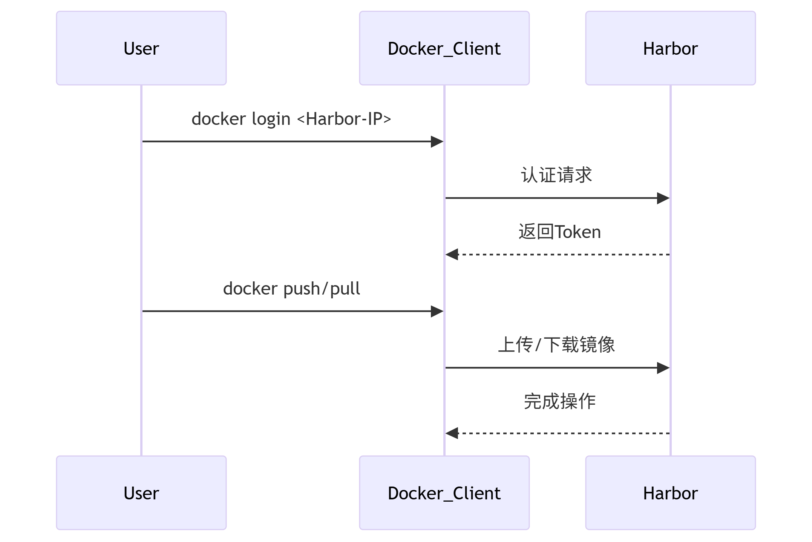

# Harbor 使用

## 1. [安装Harbor](https://goharbor.io/docs/2.13.0/install-config/download-installer/) 
此处使用官方离线安装包

### 1. 下载解压
   ``` bash
   # 安装编译依赖
   # 安装 Docker
   sudo yum install -y yum-utils
   sudo yum-config-manager --add-repo https://download.docker.com/linux/centos/docker-ce.repo
   sudo yum install -y docker-ce docker-ce-cli containerd.io
   sudo systemctl enable --now docker

   # 安装 Docker Compose 页面下载的话注意版本比如 验证系统架构uname -m输出x86_64
   sudo curl -L "https://github.com/docker/compose/releases/download/v2.23.3/docker-compose-$(uname -s)-$(uname -m)" -o /usr/local/bin/docker-compose
   sudo chmod +x /usr/local/bin/docker-compose

   # 下载Harbor并解压 (我用的离线安装包包含所有依赖镜像)
   wget https://github.com/goharbor/harbor/releases/download/v2.12.3/harbor-offline-installer-v2.12.3.tgz
   tar -xzvf harbor-offline-installer-v2.12.3.tgz
   cd harbor
   ```
### 2. 生成自签名证书（IP方式）
   **如果使用http则不需要设置**
   ``` bash
   sudo mkdir -p /etc/harbor/ssl
   sudo chmod 755 /etc/harbor/ssl
   sudo openssl req -x509 -nodes -days 365 -newkey rsa:2048 \
   -keyout /etc/harbor/ssl/your_ip.key \
   -out /etc/harbor/ssl/your_ip.crt \
   -subj "/CN=your_ip" -addext "subjectAltName=IP:your_ip"
   ```
   验证权限
   ``` bash
   sudo chmod 644 /etc/harbor/ssl/115.190.22.13.*
   sudo chown -R 10000:10000 /etc/harbor/ssl  # Harbor容器用户需可读
   ```
### 3. 修改harbor.yml配置
   ``` bash
   cp harbor.yml.tmpl harbor.yml
   vim harbor.yml
   ```
   harbor.yml示例
   ```
   # 基础配置
   hostname: 公网IP  # 例如 123.123.123.123
   http:
   port: 80           # HTTP 端口
   falseenabled: false
   https:
   port: 443
   certificate: /etc/harbor/ssl/your_ip.crt
   private_key: /etc/harbor/ssl/your_ip.key

   # 数据库和存储
   database:
   password: "Harbor12345"
   data_volume: "/data"  # 数据存储路径

   # 管理员账户
   harbor_admin_password: "Harbor12345"  # 修改默认密码！

   # 其他服务（按需启用）
   chart:
   absolute_url: disabled
   log:
   level: info
   local:
      rotate_count: 50
      rotate_size: 200M
   ```
### 4. 执行安装
   ``` bash
   sudo ./install.sh
   ```
### 5. 防火墙配置
   ```bash
   sudo firewall-cmd --permanent --add-port=443/tcp
   sudo firewall-cmd --permanent --add-port=4443/tcp  # Docker Registry端口
   sudo firewall-cmd --reload
   ```

### 6. 客户端配置   
   1.  **如果使用https** 需要Docker 客户端信任自签名证书
      ``` bash
      # 将生成的 .crt 文件复制到 Docker 客户端
      sudo mkdir -p /etc/docker/certs.d/您的公网IP:443
      sudo scp /etc/harbor/ssl/your_ip.crt /etc/docker/certs.d/您的公网IP:443/ca.crt
      sudo systemctl restart docker
      ```
   2. **如果使用http** Docker 客户端取消 HTTPS 限制
      ``` bash
      sudo tee /etc/docker/daemon.json <<-'EOF'
      {
      "insecure-registries": ["你的IP:8080"]  # 例如 "192.168.1.100:8080"
      }
      EOF

      # 重启 Docker
      sudo systemctl restart docker
      ```
   3. 登录 Harbor
   ``` bash
   docker login 您的公网IP -u admin -p Harbor12345
   ```

### 7. 验证安装
   1. 检查服务状态
      ``` bash
      docker-compose ps
      ```
      正常输出应显示所有服务为 Up 状态。
   2. 浏览器访问
      * 访问 https://ip地址
      * 用户名: admin，密码: YourSecurePassword123
   3. API测试
      ``` bash
      curl -vk https://替换自己IP/api/v2.0/ping
      ```
      应返回 {"message":"pong"}。


## 2. 维护命令
|操作	|命令|
|:--|:--|
|停止 Harbor	|docker-compose down -v|
启动 Harbor	|docker-compose up -d|
卸载 Harbor|	sudo ./install.sh --uninstall|
备份数据|	tar -czvf harbor-backup.tar.gz /data|
* **这些命令执行需要在harbor的安装目录**

## 3. 页面操作指南
1. 访问 Harbor 控制台
   * 浏览器打开：https://<你的IP或域名>（如果使用 HTTP，则访问 http://<你的IP或域名>）
   * 默认账号：admin
   * 默认密码：harbor.yml 中配置的 harbor_admin_password（如 Harbor12345）
2. 首次登录后操作
   1. 修改密码（强制）：
      * 登录后系统会提示修改默认密码。
   2. 创建项目（Project）：
      * 导航至 项目 → 新建项目
      * 输入项目名称（如 my-project），选择访问级别（公开/私有）。
   3. **推送镜像到 Harbor：**
      ``` bash
      # 登录 Docker 客户端
      docker login <你的IP或域名> -u admin -p <你的密码>

      # 标记并推送镜像
      docker tag nginx:latest <你的IP或域名>/my-project/nginx:v1
      docker push <你的IP或域名>/my-project/nginx:v1
      ```
   4. 从 Harbor 拉取镜像：
   ``` bash
   docker pull <你的IP或域名>/my-project/nginx:v1
   ```

## 4. 核心功能操作
1. 用户管理
   * 路径：系统管理 → 用户管理
   * 操作：
     * 创建新用户
     * 分配角色（如项目管理员、开发者）

2. 镜像安全扫描
   * 路径：进入项目 → 选择镜像 → 扫描
   * 功能：自动检测镜像漏洞（需安装 Trivy 插件）。
3. 配置 Webhook
   * 路径：项目 → 机器人账户 → 新建Webhook
   * 用途：监听镜像推送事件，触发 CI/CD 流程。

4. 启用内容信任（Notary）
   * 路径：系统管理 → 配置 → 内容信任
   * 作用：确保镜像来源可信（需额外配置证书）。

## 5. 常见问题排查
1. 如果./install.sh执行出现问题，检查修改后完全清理后重新安装
   ``` bash
   # 停止并删除旧容器
   docker-compose down -v

   # 删除旧配置
   sudo rm -rf /data/database /data/registry /data/secret

   # 重新安装
   sudo ./install.sh
   ```
2. 无法推送/拉取镜像
   ``` bash
   # 确认 Docker 客户端已信任证书
   ls /etc/docker/certs.d/<你的IP或域名>:443/ca.crt

   # 检查防火墙
   sudo firewall-cmd --list-ports | grep 443
   ```
3.  控制台访问卡顿
   * 优化方案：
      ``` bash
      # 调整 Harbor 资源限制
      vim docker-compose.yml
      ```
   * 修改 resources 部分（示例）：
      ``` bash
      nginx:
      deploy:
         resources:
            limits:
            cpus: "1"
            memory: 2G
      ```
4. 忘记管理员密码
   ``` bash
   # 进入数据库容器重置
   docker exec -it harbor-db psql -U postgres -d registry
   UPDATE harbor_user SET password='$2a$10$123456' WHERE username='admin';
   ```

## 6. 流程图：镜像推拉流程


参考 [Harbor 官方文档]。(https://goharbor.io/docs/)