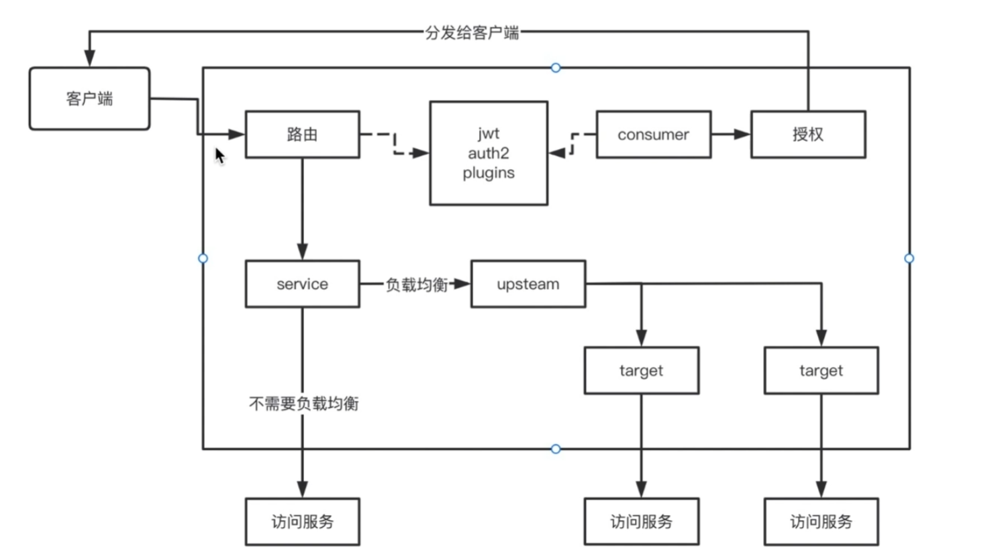

# Kong API网关

## API网关特点
* 集合多个API，统一API入口
* 避免内部信息泄露
* 提供安全认证
* 支持混合通讯协议
* 降低微服务复杂度

常用的API网关有：NGINX，Zuul，Kong
  

## Kong 介绍
  kong是微服务中的一个网关组件，具有高可用和可扩展性，能提供易于使用的restful api来操作和配置API管理系统，同时它也可以通过负载均衡的功能把请求均匀的分发到各个服务器上，应对大量的请求。基于Nginx和OpenResty，是一个具有分布式、高性能、高并发、可伸缩...亚毫秒级延迟等特性和功能的微服务抽象层。

## konga 是kong的UI界面

* 多用户管理
* 管理多个kong节点
* 使用快照备份，还原和迁移Kong节点
* 使用运行状态检查监控节点和API状态
* 数据库集成postgresSQL

## Kong 流程图



## Kong 安装
[Kong下载安装](https://getkong.org/install/)

[Konga下载安装](https://github.com/pantsel/konga) 


## API操作 [文档地址](https://docs.konghq.com/gateway/3.5.x/admin-api/)

示例:

### 负载均衡
```
# 添加负载均衡
curl -i -X POST \
   -H "Content-Type:application/x-www-form-urlencoded" \
   -d "name=demo-upstream" \
 'http://127.0.0.1:8001/upstreams'

#设置权重
curl -i -X POST \
   -H "Content-Type:application/x-www-form-urlencoded" \
   -d "target=127.0.0.1:8000" \
   -d "weight=100" \
 'http://127.0.0.1:8001/upstreams/demo-upstream/targets'

 curl -i -X POST \
   -H "Content-Type:application/x-www-form-urlencoded" \
   -d "target=127.0.0.1:8080" \
   -d "weight=500" \
 'http://127.0.0.1:8001/upstreams/demo-upstream/targets'


```

### 添加Service
```
# 添加负载均衡
curl -i -X POST \
   -H "Content-Type:application/x-www-form-urlencoded" \
   -d "name=demo-service" \
   -d "host=demo-upstream" \
 'http://127.0.0.1:8001/services'
```

### 添加路由
```
# 添加负载均衡
curl -i -X POST \
   -H "Content-Type:application/x-www-form-urlencoded" \
   -d "name=demo-service-route" \
   -d "paths[]=/abc" \
 'http://127.0.0.1:8001/services/demo-service/routes'
```

### Plugins 为路由添加basic-auth
```
curl -i -X POST \
   -H "Content-Type:application/x-www-form-urlencoded" \
   -d "name=basic-auth" \
   -d "config.hide_credentials=true" \
 'http://127.0.0.1:8001/routes/demo-service-route/plugins'

## 添加成功后需要添加CONSUMERS在Plugins添加basic auth
 ```

### Plugins 为services添加jwt
```
curl -i -X POST \
   -H "Content-Type:application/x-www-form-urlencoded" \
   -d "name=jwt" \
   -d "config.hide_credentials=true" \
 'http://127.0.0.1:8001/services/demo-service/plugins'

## 添加成功后需要CONSUMERS配置jwt
 ```

### Plugins 为services添加oauth2
```
curl -i -X POST \
   -H "Content-Type:application/x-www-form-urlencoded" \
   -d "name=oauth2" \
   -d "config.enable_authorization_code=true" \
   -d "config.enable_client_credentials=true" \
   -d "config.token_expiration=7200" \
 'http://127.0.0.1:8001/services/demo-service/plugins'

## 添加成功后需要CONSUMERS在Plugins添加auth2
curl -i -X POST \
   -H "Content-Type:application/x-www-form-urlencoded" \
   -d "name=test" \
   -d "config.client_id=true" \
   -d "config.client_secret=true" \
   -d "config.token_expiration=7200" \
 'http://127.0.0.1:8001/consumers/test/oauth2'

 ## 替换下面的client_id和client_secret获取Token 
 curl -i -X POST \
   -H "Content-Type:application/x-www-form-urlencoded" \
   -d "grant_type=client_credentials" \
   -d "client_id=xxx" \
   -d "client_secret=xxx" \
   -d "config.token_expiration=7200" \
 'http://127.0.0.1:8443/abc/oauth2/token'
 ```

### Plugins 为services添加限流
```
# 限制IP每分钟5次
curl -i -X POST \
   -H "Content-Type:application/x-www-form-urlencoded" \
   -d "name=rate-limiting" \
   -d "config.minute=5" \
   -d "config.limit_by=ip" \
 'http://127.0.0.1:8001/services/demo-service/plugins'
```

### Plugins 为services添加黑白名单
```
# 限制127.0.0.1访问
curl -i -X POST \
   -H "Content-Type:application/x-www-form-urlencoded" \
   -d "name=ip-restriction" \
   -d "config.deny=127.0.0.1" \
 'http://127.0.0.1:8001/services/demo-service/plugins'
 ```


